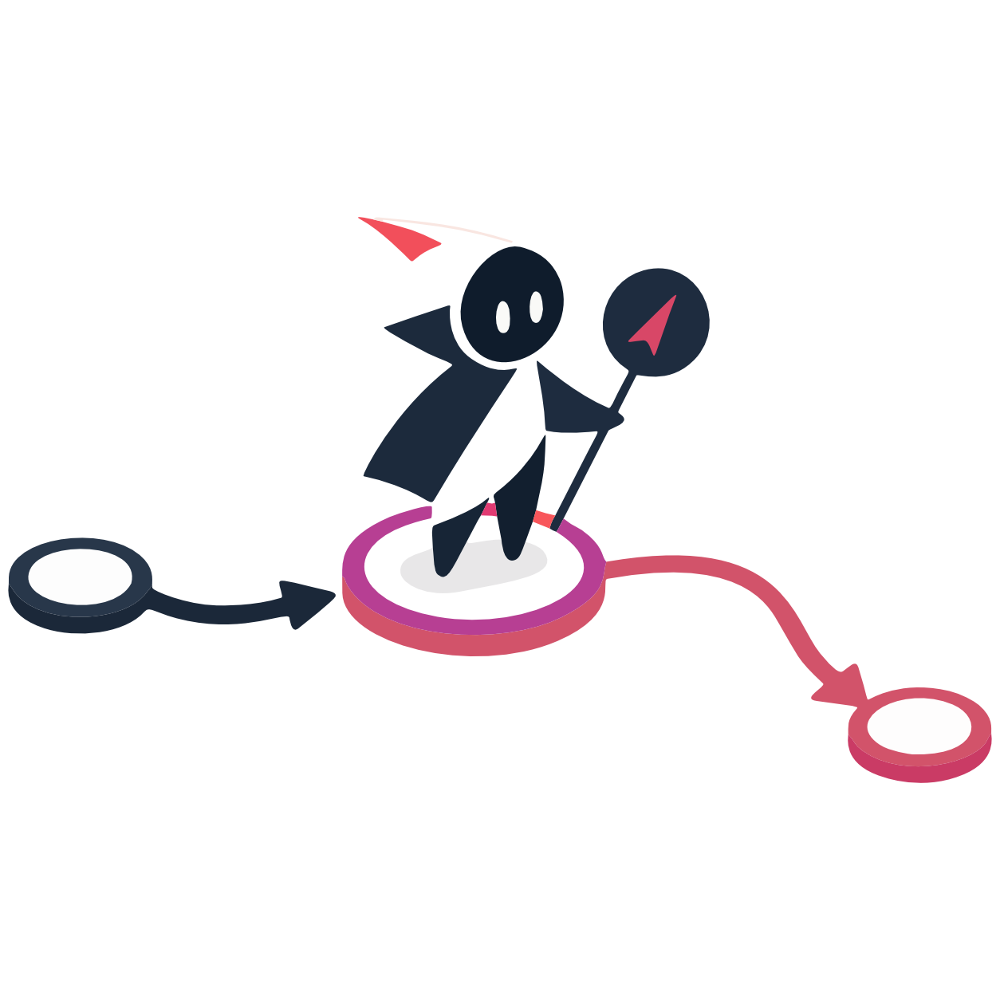

# codegraph-mcp

<p align="center">
  
</p>

<br />

Intent search over your Python repo's call graph, inside Cursor. One MCP tool returns cite spans and caller→anchor→callee chains so the agent searches once, reads surgically, and burns fewer tokens than grep-then-read loops.

## Demo

<p align="center">
  <a href="https://github.com/SahilSheikh12299/codegraph-mcp/blob/main/assets/demo.mp4">
    
  </a>
</p>

<p align="center">
  <strong><a href="https://github.com/SahilSheikh12299/codegraph-mcp/blob/main/assets/demo.mp4">▶ Watch demo</a></strong>
  <br />
  <sub>Click the image or link — opens GitHub's video player</sub>
</p>

<br />

## Requirements

All of the following are **required**:

| Component | Purpose |
|-----------|---------|
| **Python 3.10+** | Runtime |
| **Ollama** | Generates intent docstrings during indexing |
| **`qwen2.5:1.5b`** | Ollama model for docstrings |
| **`BAAI/bge-large-en-v1.5`** | Embedding model (HuggingFace, downloaded on setup/first run) |
| **`mixedbread-ai/mxbai-rerank-base-v2`** | Cross-encoder reranker (HuggingFace) |

**Hardware:** ~8 GB RAM recommended; ~3–5 GB disk for models after first run.

**Scope:** Python repositories only (for now).

## Quick start

```bash
# 1. Ollama + required model
brew install ollama          # or https://ollama.com
ollama pull qwen2.5:1.5b

# 2. Install codegraph-mcp (once)
python -m venv .venv
source .venv/bin/activate
pip install "git+https://github.com/SahilSheikh12299/codegraph-mcp.git"

# 3. Global setup (once)
codegraph-mcp setup
```

Then **restart Cursor** (or reload MCP in Settings → MCP).

Open **any** Python repo and ask Cursor where behavior lives — e.g. *"Where is authentication handled?"* The first search indexes that repo; later searches use the cache at `~/.cursor_graph_rag/graphs/`.

No per-project configuration needed.

## Pinned install

```bash
pip install "git+https://github.com/SahilSheikh12299/codegraph-mcp.git@v0.1.0"
```

## Usage

The MCP server exposes one tool:

### `search_codebase_intent`

```python
search_codebase_intent(
    search_queries=["how redirects are resolved after HTTP response"],
    active_project_root="/absolute/path/to/repo",
    grep_terms=["resolve_redirects"],  # optional symbol anchors
)
```

Returns markdown with up to **2 matches per grep term and per search query**: anchor cite, a tiny call flow, and caller/callee cites. The agent reads those line ranges with native Read — no full-file dumps.

`active_project_root` is the absolute workspace root (Cursor provides this in context).

## What `setup` does

`codegraph-mcp setup` runs once globally:

1. Verifies Ollama is running and `qwen2.5:1.5b` is installed
2. Prefetches HuggingFace embedding + reranker models (warns if offline)
3. Merges `codegraph-mcp` into `~/.cursor/mcp.json`
4. Installs agent skill at `~/.cursor/skills/codegraph-mcp/SKILL.md`

## Performance expectations

| Phase | What happens | Typical feel |
|-------|----------------|--------------|
| **First `setup`** | Ollama check + HF model download (~3–5 GB) | One-time; minutes if models aren't cached |
| **First search on a repo** | Incremental index: Ollama docstrings → call graph → embeddings | Minutes on medium/large repos; seconds on tiny ones |
| **Later searches (warm cache)** | Mtime check only; embed/rerank changed files | Usually seconds |
| **Every search call** | Reloads embedding + reranker models, runs sync under a file lock, then retrieves | Adds model load time between idle searches (see below) |

**Why searches aren't instant:** Each `search_codebase_intent` call syncs the graph for that workspace, then searches. That keeps results fresh but means the tool is "sync then search," not a pure in-memory lookup.

**Model memory:** Embedding and reranker models unload after each tool call to keep RAM down. The next search pays load cost again (~few seconds on CPU, faster with GPU). Concurrent overlapping calls share one loaded instance.

**Rough repo sizing (first index, CPU, Ollama docstrings on):**

| Repo size | Python files | Ballpark first index |
|-----------|--------------|----------------------|
| Tiny | &lt; 20 | ~30s–2 min |
| Small | 20–100 | ~2–10 min |
| Medium | 100–500 | ~10–30+ min |
| Large | 500+ | 30+ min; consider `CURSOR_GRAPHRAG_AUTO_DOCSTRINGS=0` for a faster cold start |

Disable auto-docstrings during indexing if you only want speed over semantic richness:

```bash
export CURSOR_GRAPHRAG_AUTO_DOCSTRINGS=0
```

## Known limitations (v0.1)

- **Python only** — `.py` source files; no JS, Go, notebooks as first-class targets.
- **Static call graph** — `CALLS` edges come from AST name resolution + import tracking. Dynamic dispatch (`getattr`, `eval`, heavy metaprogramming) may be missing or incomplete.
- **Cursor + MCP** — Tested around Cursor's MCP workflow and agent skill; other MCP hosts may work but aren't the primary target.
- **Agent discipline** — The skill guides "one search, surgical reads," but the host model can still grep or over-read if it ignores the skill.
- **Top-2 per term** — Returns at most two matches per grep term and per intent query by design (token budget). Obscure symbols may need a refined query or `grep_terms`.
- **Local stack required** — Ollama + HuggingFace models; not a hosted/API-only product.
- **Single global MCP process** — One Python env serves all workspaces; model weights install once in that venv.

## Documentation

- [Installation guide](docs/installation.md)
- [Configuration](docs/configuration.md)
- [Architecture](docs/architecture.md)

## Development

```bash
git clone https://github.com/SahilSheikh12299/codegraph-mcp.git
cd codegraph-mcp
python -m venv .venv && source .venv/bin/activate
pip install -e ".[dev]"
pytest
```

## License

MIT — see [LICENSE](LICENSE).
